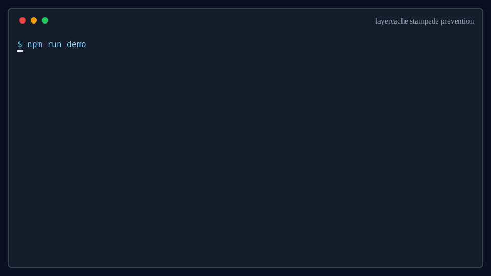

<p align="center">
  <strong>English</strong> | <a href="./docs/i18n/README.ko.md">한국어</a> | <a href="./docs/i18n/README.zh-CN.md">简体中文</a> | <a href="./docs/i18n/README.ja.md">日本語</a> | <a href="./docs/i18n/README.es.md">Español</a>
</p>

<p align="center">
  
</p>

<h1 align="center">layercache</h1>

<p align="center">
  <strong>100 concurrent requests. 1 DB call. Always.</strong><br>
  <em>Multi-layer cache (Memory → Redis → Disk) with stampede prevention built in.</em>
</p>

<p align="center">
  <a href="https://www.npmjs.com/package/layercache"></a>
  <a href="https://www.npmjs.com/package/layercache"></a>
  <a href="./LICENSE"></a>
  <a href="https://www.typescriptlang.org/"></a>
  = 20">
  
  <a href="https://coveralls.io/github/flyingsquirrel0419/layercache?branch=main"></a>
</p>

<p align="center">
  <a href="https://flyingsquirrel0419.github.io/layercache">Website</a>&nbsp;&nbsp;|&nbsp;&nbsp;
  <a href="#-quick-start">Quick Start</a>&nbsp;&nbsp;|&nbsp;&nbsp;
  <a href="#-performance">Performance</a>&nbsp;&nbsp;|&nbsp;&nbsp;
  <a href="./docs/api.md">API Reference</a>&nbsp;&nbsp;|&nbsp;&nbsp;
  <a href="#-integrations">Integrations</a>&nbsp;&nbsp;|&nbsp;&nbsp;
  <a href="#-comparison">Comparison</a>&nbsp;&nbsp;|&nbsp;&nbsp;
  <a href="./docs/tutorial.md">Tutorial</a>&nbsp;&nbsp;|&nbsp;&nbsp;
  <a href="./docs/migration-guide.md">Migration Guide</a>
</p>

---

## Why layercache?

```ts
// 100 concurrent requests hit an empty cache at the same time.
// Without stampede prevention, your DB gets 100 calls.
const results = await Promise.all(
  Array.from({ length: 100 }, () =>
    cache.get('user:1', () => db.findUser(1))
  )
)
// fetcherExecutions: 1  ← your DB was called exactly once
```

layercache is a multi-layer cache (Memory → Redis → Disk) for Node.js. Stampede prevention, tag invalidation, and distributed consistency are built in — no extra config required.

---

## What's New in 5.0

- **Breaking:** `createTrpcCacheMiddleware` and `cacheGraphqlResolver` now require a `keyResolver` — the `allowImplicitContextCaching` option is removed. Implicit path+input or argument-only keys could not distinguish authenticated callers and could leak one user's data to another.
- The Express and Hono cache middlewares no longer serve one user's authenticated response to another: requests carrying authentication headers (`authorization`, `cookie`, `set-cookie`, `x-api-key`, `x-session-id`, `x-auth-token`, `x-forwarded-user`) bypass implicit URL-only caching unless you supply a `keyResolver`. Header names are matched case-insensitively.
- `RedisInvalidationBus` gained `requireSignature` to fail fast when a signing secret is missing, preventing unsigned invalidation channels that any Redis publisher could forge messages on.
- The test suite is split into unit and real-Redis Vitest projects (`npm test`, `npm run test:integration`, `npm run test:all`), and the local docker-compose Redis port is configurable via `REDIS_PORT`.

See the [5.0 changelog](./CHANGELOG.md#500--2026-08-28) and the [migration guide](./docs/migration-guide.md#upgrading-to-50) before upgrading an existing deployment.

### What's New in 4.0

- Public `get()`, `getOrSet()`, `mget()`, `wrap()`, and namespace reads return `undefined` on misses while preserving intentional cached `null` values. Read-through fetchers cache `null` by default, and `getOrThrow()` throws only for `undefined`.
- Structured `wrap()` argument keys use the collision-resistant `j2:` schema. Existing `j:` entries become cold misses and expire naturally.
- Single, bulk, and write-behind operations share bounded per-key ordering, preventing stale writes from repopulating invalidated keys and surfacing overload as `CacheWriteSaturationError`.
- Generation cleanup is streamed and capped at 10,000 discovered keys by default, with explicit tuning and opt-out controls.
- Snapshot commits, protected `DiskLayer` reads, signed invalidation, HTTP credential handling, destructive CLI patterns, OpenTelemetry key attributes, and the docs playground trust boundary are hardened.
- Benchmark TTLs now match the documented millisecond API, and the benchmark runner uses current `autocannon` dependencies with a clean npm audit.

See the [4.0 changelog](./CHANGELOG.md#400--2026-07-19) before upgrading an existing deployment.

---

## Quick Start

```bash
npm install layercache
```

```ts
import { CacheStack, MemoryLayer, RedisLayer } from 'layercache'
import Redis from 'ioredis'

const cache = new CacheStack([
  new MemoryLayer({ ttl: 60_000, maxSize: 1_000 }),       // L1: in-process
  new RedisLayer({ client: new Redis(), ttl: 3_600_000 }),  // L2: shared
])

// Read-through: fetcher runs once, all layers filled
const user = await cache.get('user:123', () => db.findUser(123))
```

<details>
<summary><b>Memory-only (no Redis required)</b></summary>

```ts
const cache = new CacheStack([
  new MemoryLayer({ ttl: 60_000 })
])
```

</details>

<details>
<summary><b>Three-layer setup with disk persistence</b></summary>

```ts
import { CacheStack, MemoryLayer, RedisLayer, DiskLayer } from 'layercache'

const cache = new CacheStack([
  new MemoryLayer({ ttl: 60_000, maxSize: 5_000 }),
  new RedisLayer({ client: new Redis(), ttl: 3_600_000, compression: 'gzip' }),
  new DiskLayer({ directory: './var/cache', maxFiles: 10_000 }),
])
```

</details>

---

## Performance

```
Measured 2026-07-16 on Node.js v24.16.0, Redis 7.4.9, Docker 29.1.3, Linux x86_64
CPU: 2 vCPU (AMD Ryzen 9 9900X host)  |  RAM: 3.8 GiB
Layers: MemoryLayer(ttl=60_000, maxSize=2000) + RedisLayer(ttl=300_000)
```

```
┌──────────────────────────────┬──────────┬──────────┬──────────┬──────────┐
│ Scenario                     │  avg ms  │  p95 ms  │  min ms  │  max ms  │
├──────────────────────────────┼──────────┼──────────┼──────────┼──────────┤
│ L1 memory hit (warm)         │   0.013  │   0.035  │   0.004  │   0.543  │
│ L1 hit in layered setup      │   0.009  │   0.026  │   0.003  │   0.158  │
│ No cache / origin fetch      │   3.729  │   4.789  │   3.020  │   5.937  │
└──────────────────────────────┴──────────┴──────────┴──────────┴──────────┘

┌──────────────────────────────┬────────────────────┐
│                              │  75 concurrent req │
├──────────────────────────────┼────────────────────┤
│ Without layercache           │  75 origin calls   │
│ With layercache              │   1 origin call    │  ← stampede prevention
└──────────────────────────────┴────────────────────┘
```

The HTTP benchmark used 40 connections for 8 seconds per route:

| Route | Requests/sec | Avg latency | p97.5 latency | Errors/timeouts |
|---|---:|---:|---:|---:|
| No cache / origin | 261 | 153.88 ms | 203 ms | 0 / 0 |
| Memory cache | 38,151 | 0.40 ms | 2 ms | 0 / 0 |
| Layered cache, warm L1 | 37,600 | 0.42 ms | 2 ms | 0 / 0 |

These are reproducible snapshots from one constrained host, not universal guarantees. Workload, payload size, CPU allocation, Redis placement, and network latency will change the result.

Benchmark commands, methodology, edge/slow-Redis results, and the full environment: [docs/benchmarking.md](./docs/benchmarking.md)

---

## Migrating from node-cache-manager?

<table>
<tr>
<th>Before</th>
<th>After</th>
</tr>
<tr>
<td>

```ts
import { caching, multiCaching }
  from 'cache-manager'
import { redisStore }
  from 'cache-manager-redis-yet'

const mem = await caching('memory', {
  max: 100,
  ttl: 60 * 1000        // ms
})
const red = await caching(redisStore, {
  url: 'redis://localhost:6379',
  ttl: 300 * 1000       // ms
})
const cache = multiCaching([mem, red])

// stampede prevention:  ❌
// auto backfill:        ❌
// tag invalidation:     ❌
```

</td>
<td>

```ts
import {
  CacheStack,
  MemoryLayer,
  RedisLayer
} from 'layercache'
import Redis from 'ioredis'

const cache = new CacheStack([
  new MemoryLayer({ ttl: 60_000 }),    // ms
  new RedisLayer({
    client: new Redis(),
    ttl: 300_000                       // ms
  })
])

// stampede prevention:  ✅
// auto backfill:        ✅
// tag invalidation:     ✅
```

</td>
</tr>
</table>

> Full migration guides for [keyv and cacheable](./docs/migration-guide.md).

---

## Comparison

|  | node-cache-manager | keyv | cacheable | BentoCache | **layercache** |
|---|:---:|:---:|:---:|:---:|:---:|
| Multi-layer + auto backfill | Partial | Plugin | -- | Partial | **Yes** |
| Stampede prevention | -- | -- | -- | Partial | **Yes** |
| Tag invalidation | -- | Yes | Yes | Yes | **Yes** |
| TypeScript-first | Partial | Yes | Yes | Yes | **Yes** |
| Event hooks | Yes | Yes | Yes | Yes | **Yes** |

<details>
<summary>Full comparison (19 features)</summary>

|  | node-cache-manager | keyv | cacheable | BentoCache | **layercache** |
|---|:---:|:---:|:---:|:---:|:---:|
| Multi-layer with auto backfill | Partial | Plugin | -- | Partial | **Yes** |
| Stampede prevention | -- | -- | -- | Partial | **Yes** |
| Distributed single-flight | -- | -- | -- | -- | **Yes** |
| Tag invalidation | -- | Yes | Yes | Yes | **Yes** |
| Distributed tags | -- | -- | -- | -- | **Yes** |
| Cross-server L1 flush | -- | -- | -- | Yes | **Yes** |
| Stale-while-revalidate | -- | -- | -- | Yes | **Yes** |
| Circuit breaker | -- | -- | -- | Yes | **Yes** |
| Graceful degradation | -- | -- | -- | Yes | **Yes** |
| Sliding / adaptive TTL | -- | -- | -- | -- | **Yes** |
| Cache warming | -- | -- | -- | -- | **Yes** |
| Persistence / snapshots | -- | -- | -- | -- | **Yes** |
| Compression | -- | -- | Yes | -- | **Yes** |
| Admin CLI | -- | -- | -- | -- | **Yes** |
| TypeScript-first | Partial | Yes | Yes | Yes | **Yes** |
| Wrap / decorator API | Yes | -- | -- | Partial | **Yes** |
| Namespaces | -- | Yes | Yes | Yes | **Yes** |
| Event hooks | Yes | Yes | Yes | Yes | **Yes** |
| Custom layers | Partial | -- | -- | Yes | **Yes** |

</details>

> See the full [comparison guide](./docs/comparison.md) for detailed breakdowns.

---

## Features

<details>
<summary><b>Core Caching, Invalidation, Resilience & Observability (click to expand)</b></summary>

### Core Caching

| Feature | What it does |
|---|---|
| **Layered reads + auto backfill** | Reads hit L1 first; on a partial hit, upper layers are filled automatically |
| **Stampede prevention** | 100 concurrent requests for the same key = 1 fetcher execution |
| **Distributed single-flight** | Cross-instance dedup via Redis locks with lease renewal |
| **Bulk operations** | `getMany()` / `setMany()` / `mdelete()` with layer-level fast paths |
| **`wrap()` API** | Transparent function caching with automatic key derivation |
| **Namespaces** | Scoped cache views with hierarchical prefix support |
| **Cache warming** | Pre-populate layers at startup with priority-based loading |
| **Negative caching** | Cache misses (e.g., "user not found") for short TTLs |
| **Stored null values** | Intentional `null` values are cached by default and remain distinct from `undefined` misses |
| **Entry introspection** | `getEntry()` reports value, kind, state, key, and source layer |

### Invalidation & Freshness

| Feature | What it does |
|---|---|
| **Tag invalidation** | Delete all keys with a given tag across all layers |
| **Batch tag invalidation** | Multi-tag operations with `any` / `all` semantics |
| **Wildcard & prefix invalidation** | Glob-style and hierarchical key patterns |
| **Generation-based rotation** | Bulk namespace invalidation without scanning |
| **Stale-while-revalidate** | Return cached value, refresh in background |
| **Stale-if-error** | Keep serving stale when upstream fails |
| **Sliding TTL** | Reset expiry on every read for frequently-accessed keys |
| **Adaptive TTL** | Auto-ramp TTL for hot keys up to a ceiling |
| **Refresh-ahead** | Proactively refresh before expiry |
| **TTL policies** | Align expirations to calendar boundaries (`until-midnight`, `next-hour`, custom) |
| **Context-aware entry options** | Derive TTLs and tags from the cached value right before storage |

### Resilience & Operations

| Feature | What it does |
|---|---|
| **Graceful degradation** | Skip failed layers temporarily, keep cache available |
| **Circuit breaker** | Stop hammering broken upstreams after repeated failures |
| **Shared circuit breaker scopes** | Group failures by backend dependency with `scope: 'shared'` and `breakerKey` |
| **Fetcher rate limiting** | Scoped to global, per-key, or per-fetcher; `queueOverflow: 'reject'` rejects saturated queues and `'bypass'` runs overflow work directly |
| **Write policies** | `strict` (fail if any layer fails) or `best-effort` |
| **Write-behind** | Batch writes with configurable flush interval |
| **Bounded write coordination** | `CacheStack.writeCoordination` bounds retained per-key ordering state, and `DiskLayer.maxWriteQueueDepth` bounds serialized disk work |
| **Compression** | gzip / brotli in RedisLayer with configurable threshold |
| **MessagePack** | Pluggable serializers (JSON default, MessagePack alternative) |
| **Persistence** | Export/import snapshots to memory or disk |

### Observability

| Feature | What it does |
|---|---|
| **Metrics** | Hits, misses, fetches, stale hits, circuit breaker trips, and more |
| **Per-layer latency** | Avg, max, and sample count using Welford's algorithm |
| **Health checks** | Async health endpoint per layer with latency measurement |
| **Event hooks** | `hit`, `miss`, `set`, `delete`, `expire`, `stale-serve`, `stampede-dedupe`, `backfill`, `warm`, `error` |
| **OpenTelemetry** | Hook-based distributed tracing support without method monkey-patching |
| **Prometheus exporter** | Metrics export including latency gauges |
| **HTTP stats handler** | JSON endpoint for dashboards |
| **Admin CLI** | `npx layercache stats\|keys\|invalidate` for Redis-backed caches |

</details>

---

## Integrations

layercache plugs into the frameworks you already use:

| Framework | Integration |
|---|---|
| **Express** | `createExpressCacheMiddleware(cache, opts)` - auto-caches responses with `x-cache: HIT/MISS` header |
| **Fastify** | `createFastifyLayercachePlugin(cache, opts)` - registers `fastify.cache` with optional stats route |
| **Hono** | `createHonoCacheMiddleware(cache, opts)` - edge-compatible middleware |
| **tRPC** | `createTrpcCacheMiddleware(cache, prefix, opts)` - procedure middleware |
| **GraphQL** | `cacheGraphqlResolver(cache, prefix, resolver, opts)` - field resolver wrapper |
| **Next.js** | Works natively with App Router and API routes |
| **OpenTelemetry** | `createOpenTelemetryPlugin(cache, tracer)` - event-driven tracing spans with hashed cache-key attributes by default |

<details>
<summary><b>Express example</b></summary>

```ts
import { CacheStack, MemoryLayer, createExpressCacheMiddleware } from 'layercache'

const cache = new CacheStack([new MemoryLayer({ ttl: 60_000 })])

app.get('/api/users', createExpressCacheMiddleware(cache, {
  ttl: 30_000,
  tags: ['users'],
  keyResolver: (req) => `users:${req.url}`
}), async (req, res) => {
  res.json(await db.getUsers())
})
```

</details>

<details>
<summary><b>Next.js App Router example</b></summary>

```ts
export async function GET(_req: Request, { params }: { params: { id: string } }) {
  const data = await cache.get(`user:${params.id}`, () => db.findUser(Number(params.id)))
  return Response.json(data)
}
```

</details>

---

## Distributed Deployments

layercache is built for multi-instance production environments:

```
  ┌───────────┐    ┌───────────┐    ┌───────────┐
  │ Server A  │    │ Server B  │    │ Server C  │
  │ [Memory]  │    │ [Memory]  │    │ [Memory]  │
  └─────┬─────┘    └─────┬─────┘    └─────┬─────┘
        │                │                │
        └──── Redis Pub/Sub ──────────────┘  <-- L1 invalidation bus
                     │
               ┌─────┴──────┐
               │   Redis    │  <-- shared L2 + tag index + single-flight
               └────────────┘
```

- **Redis single-flight** - dedup misses across instances with distributed locks
- **Redis invalidation bus** - pub/sub-based L1 invalidation for memory consistency; set `signingSecret` for shared Redis channels (and `requireSignature: true` to fail fast when the secret is missing — without signing, any client that can publish to the channel can forge invalidation messages)
- **Redis tag index** - shared tag tracking with 16 known-key shards by default
- **Snapshot persistence** - export/import state between instances

<details>
<summary><b>Full distributed setup</b></summary>

```ts
import {
  CacheStack, MemoryLayer, RedisLayer,
  RedisInvalidationBus, RedisTagIndex, RedisSingleFlightCoordinator
} from 'layercache'

const redis = new Redis(process.env.REDIS_URL)
const bus = new RedisInvalidationBus({
  publisher: redis,
  subscriber: new Redis(process.env.REDIS_URL),
  signingSecret: process.env.LAYERCACHE_INVALIDATION_SECRET,
  requireSignature: process.env.NODE_ENV === 'production'
})
const tagIndex = new RedisTagIndex({ client: redis, prefix: 'myapp:tags', knownKeysShards: 16 })
const coordinator = new RedisSingleFlightCoordinator({ client: redis })

const cache = new CacheStack(
  [
    new MemoryLayer({ ttl: 60_000, maxSize: 10_000 }),
    new RedisLayer({ client: redis, ttl: 3_600_000, prefix: 'myapp:cache:' })
  ],
  {
    invalidationBus: bus,
    tagIndex: tagIndex,
    singleFlightCoordinator: coordinator,
    gracefulDegradation: { retryAfterMs: 10_000 }
  }
)
```

</details>

---

## Documentation

| Document | Description |
|---|---|
| [API Reference](./docs/api.md) | Complete API documentation with all options |
| [Tutorial](./docs/tutorial.md) | Step-by-step operational walkthrough |
| [Comparison Guide](./docs/comparison.md) | Detailed feature comparison with alternatives |
| [Migration Guide](./docs/migration-guide.md) | Migrate from node-cache-manager, keyv, or cacheable |
| [Benchmarking](./docs/benchmarking.md) | Benchmark scenarios and methodology |
| [Changelog](./CHANGELOG.md) | Version history and breaking changes |

---

## Examples

The [`examples/`](./examples) directory contains ready-to-run projects:

- [`express-api/`](./examples/express-api/) - Express REST API with layered caching
- [`nextjs-api-routes/`](./examples/nextjs-api-routes/) - Next.js App Router with layercache

---

## Requirements

- **Node.js** >= 20
- **TypeScript** >= 5.0 (optional - fully typed, ships `.d.ts`)
- **ioredis** >= 5 (optional - only needed for Redis features)

<sub>Runtime dependencies: `async-mutex` and `@msgpack/msgpack`</sub>

---

## Contributing

Contributions welcome - bug fixes, docs, performance, new adapters, or issues.

```bash
git clone https://github.com/flyingsquirrel0419/layercache
cd layercache
npm install
npm run lint && npm test && npm run build:all
```

See the [Contributing Guide](./CONTRIBUTING.md) and [Code of Conduct](./CODE_OF_CONDUCT.md).

---

## License

[Apache 2.0](./LICENSE) - use it freely in personal and commercial projects.

---

<p align="center">
  If layercache saves you time, consider giving it a <a href="https://github.com/flyingsquirrel0419/layercache">star on GitHub</a>. It helps others discover the project.
</p>
